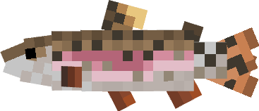

# trout

Interpreter for a simple dynamically-typed programming
language, from the book [*Crafting
Interpreters*](https://craftinginterpreters.com/) by Robert
Nystrom, implemented in Rust. For now, the program consists of three parts:

1. A scanner that reads the source code, either from a file or a REPL, and produces a sequence of tokens.
2. A parser that produces an abstract sintax tree from the sequence of tokens.
3. An interpreter that evaluates the AST and executes the code.